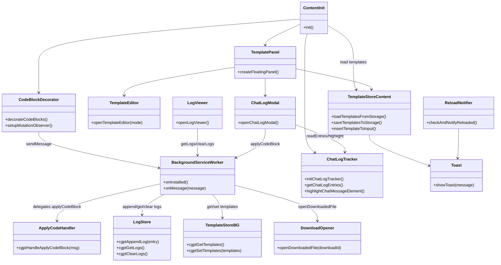

# 開発者向けガイド

このドキュメントでは gpt-code-saver-extension のアーキテクチャ、メッセージ フロー、開発時の注意点をまとめています。ユーザー向けの概要やセットアップは [README.md](README.md) を参照してください。

## リポジトリ構成
```
manifest.json (MV3)
├─ background/
│  ├─ index.js          … ルート初期化。onInstalled 登録とメッセージハンドラ設定。
│  ├─ applyCode.js      … ダウンロード API を呼び出して保存＆ログを記録。
│  ├─ logStore.js       … chrome.storage.local でログの追加・取得・削除。
│  ├─ templateStore.js  … chrome.storage.sync でテンプレートを取得・保存。
│  ├─ messageHandlers.js … type ごとの runtime メッセージハンドラを集約。
│  └─ reloadState.js    … 拡張の再読込状態を管理し、初回起動で更新。
├─ shared/
│  └─ filePathValidation.js … 背景・コンテンツ共通のファイルパス検証ロジック。
└─ content/
   ├─ init.js           … 初期化エントリ。テンプレ読込→UI生成→コード監視。
   ├─ state.js          … テンプレ配列/選択 ID を集約管理するアクセサ群。
   ├─ saveOptions.js    … 保存時のメタデータ除去フラグを保持。
   ├─ chatInput.js      … ChatGPT 入力欄の検出とテキスト挿入ユーティリティ。
   ├─ templateStore.js  … テンプレの同期、貼り付けコマンドの調停役。
   ├─ templateEditor.js … モーダル UI と CRUD 操作。
   ├─ panel.js          … 画面右下のフローティング パネル。
   ├─ codeBlockMetadata.js … コードブロック先頭の `file:` メタデータを解析。
   ├─ codeBlockViewMode.js … ラップ要素生成、行数制御、ビュー切替処理。
   ├─ codeBlockButtons.js … 保存/コピー/表示切替ボタン生成とハンドラ群。
   ├─ codeBlocks.js     … `pre code` 装飾のエントリ。各責務モジュールを連携。
   ├─ logModal.js       … 保存ログのモーダル表示＋ファイルオープン。
   ├─ chatLogTracker.js … ユーザー／アシスタント発話とコードブロックを追跡。
   ├─ chatLogModal.js   … チャット履歴と対応コードブロックを一覧化。
   ├─ toast.js          … 軽量トースト通知。
   └─ reloadNotifier.js … 拡張リロード通知の表示。
```

## モジュール間の責務


## メッセージ フロー
| 送信元 | 宛先 | type | 役割 |
| ------ | ---- | ---- | ---- |
| content/codeBlocks | background/index | `applyCodeBlock` | コード保存を要求し、結果をログ化 |
| content/chatLogModal | background/index | `applyCodeBlock` | 履歴モーダルから即時ダウンロードを要求 |
| content/templateStore | background/index | `getTemplates` / `setTemplates` | テンプレートの同期 |
| content/logModal | background/index | `getLogs` / `clearLogs` | 保存ログをモーダルに表示 |
| content/logModal | background/index | `openDownloadedFile` | ダウンロード済みファイルを OS で開く |

## 開発フローのメモ
- 依存する npm パッケージやビルドはなく、`content/` と `background/` を直接編集します。
- デバッグ時は DevTools > Sources > Service Workers で `background/index.js` のログや `chrome.runtime.sendMessage` のレスポンスを確認します。
- 既定テンプレート文言は `content/state.js` の `DEFAULT_TEMPLATE_CONTENT` で定義されています。アクセサ (`cgptSetTemplates`, `cgptSetSelectedTemplateId` など) を経由して状態を更新し、単一責務を保ってください。
- 権限を追加／削除する場合は `manifest.json` を更新し、README の「権限とプライバシー」節の整合性も確認します。
