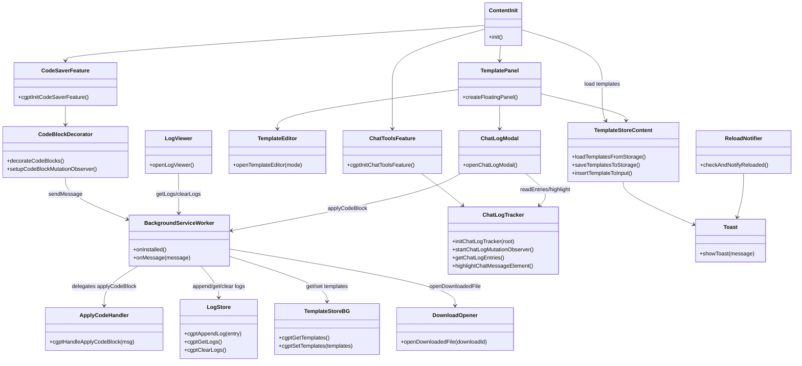

# 開発者向けガイド

このドキュメントでは gpt-code-saver-extension のアーキテクチャ、メッセージ フロー、開発時の注意点をまとめています。ユーザー向けの概要やセットアップは [README.md](README.md) を参照してください。README には利用に必要な情報のみを記載し、実装やリファクタリングの詳細は本ドキュメント側で管理します。

## リポジトリ構成
```text
extension/
├─ manifest.json (MV3)
├─ background/
│  ├─ index.js           … ルート初期化。onInstalled 登録とメッセージハンドラ設定。
│  ├─ applyCode.js       … ダウンロード API を呼び出して保存とログを記録。
│  ├─ logStore.js        … chrome.storage.local でログの追加・取得・削除。
│  ├─ templateStore.js   … chrome.storage.sync でテンプレートを取得・保存。
│  ├─ messageHandlers.js … type ごとの runtime メッセージハンドラを集約。
│  └─ reloadState.js     … 拡張の再読込状態を管理し、初回起動で更新。
├─ shared/
│  └─ filePathValidation.js … 背景・コンテンツ共通のファイルパス検証ロジック。
└─ content/
   ├─ init.js                … 初期化エントリ。テンプレ読込、UI 生成、コード監視。
   ├─ state.js               … テンプレ配列、選択 ID を集約管理するアクセサ群。
   ├─ saveOptions.js         … 保存時のメタデータ除去フラグを保持。
   ├─ chatInput.js           … ChatGPT 入力欄の検出とテキスト挿入ユーティリティ。
   ├─ templateStore.js       … テンプレの同期、貼り付けコマンドの調停役。
   ├─ templateEditor.js      … モーダル UI と CRUD 操作。
   ├─ panel.js               … 画面右下のフローティングパネル。
   ├─ codeBlockMetadata.js   … コードブロック先頭の `file:` メタデータを解析。
   ├─ codeBlockViewMode.js   … ラップ要素生成、行数制御、ビュー切替処理。
   ├─ codeBlockButtons.js    … 保存、コピー、表示切替ボタン生成とハンドラ群。
   ├─ codeBlocks.js          … `pre code` 装飾のエントリ。各責務モジュールを連携。
   ├─ logModal.js            … 保存ログのモーダル表示とファイルオープン。
   ├─ chatLogTracker.js      … ユーザー、アシスタント発話とコードブロックを追跡。
   ├─ chatLogModal.js        … チャット履歴と対応コードブロックを一覧化。
   ├─ toast.js               … 軽量トースト通知。
   └─ reloadNotifier.js      … 拡張リロード通知の表示。

tests/
├─ e2e/       … Playwright の E2E と収集系 spec
├─ unit/      … Node 組み込み test による unit test
├─ fixtures/  … 追跡する HTML fixture
├─ helpers/   … テスト共通 helper
├─ tools/     … 収集、検証、環境補助コマンド
├─ config/    … Playwright 補助設定
└─ artifacts/ … Git 管理しない証跡出力
```

## モジュール間の責務


## メッセージ フロー
| 送信元 | 宛先 | type | 役割 |
| ------ | ---- | ---- | ---- |
| content/codeBlocks | background/index | `applyCodeBlock` | コード保存を要求し、結果をログ化 |
| content/chatLogModal | background/index | `applyCodeBlock` | 履歴モーダルから即時ダウンロードを要求 |
| content/templateStore | background/index | `getTemplates` / `setTemplates` | テンプレートの同期 |
| content/logModal | background/index | `getLogs` / `clearLogs` | 保存ログをモーダルに表示 |
| content/logModal | background/index | `openDownloadedFile` | ダウンロード済みファイルを OS で開く |

## Save Flow Rules
- `Save` は既存の project folder を優先して保存します。content script 側で選択パスを整え、background 側で project folder と結合して `chrome.downloads.download` へ渡します。
- `Save As` は保存先を選ばせる経路として扱います。複数ファイルはブラウザの保存ダイアログ制約上、同一フォルダを選んでから順次保存します。
- Code Save は `file:` メタデータを優先し、Chat Log の本文保存は専用ファイル名ルールを使います。共通処理は `saveFlow.js` の `cgptRunSaveAction()` に寄せます。
- `overrideFolderPath` は一括保存などで既存 project folder を一時的に上書きしたい場合だけ使います。通常の `Save` では使いません。
- 保存ログとトーストの `source` ごとの差異を保ちつつ、失敗時は保存元と失敗理由が分かる文言に揃えます。

## 開発フローのメモ
- 依存する npm パッケージやビルドはなく、拡張本体は `extension/content/` と `extension/background/` を直接編集します。
- デバッグ時は DevTools > Sources > Service Workers で `extension/background/index.js` のログや `chrome.runtime.sendMessage` のレスポンスを確認します。
- 既定テンプレート文言は `extension/content/state.js` の `DEFAULT_TEMPLATE_CONTENT` で定義されています。アクセサ (`cgptSetTemplates`, `cgptSetSelectedTemplateId` など) を経由して状態を更新し、単一責務を保ってください。
- 権限を追加または削除する場合は `extension/manifest.json` を更新し、README の「権限とプライバシー」節の整合性も確認します。

## UI 方針
- ボタン UI は `WCAG 2.2` 準拠を前提に、`Fluent 2` の考え方をベースに統一します。最低限、十分なコントラスト、明確な `focus-visible`、`28px` 以上の押下領域を維持してください。
- 新しいボタンは `extension/shared/uiStyles.js` の `cgptCreateSharedButton` / `cgptApplySharedButtonStyle` / `cgptSetSharedButtonDisabled` を使って実装します。コンテンツ側で色、角丸、文字サイズを直書きしないでください。
- 新規コードで使う variant は `primary` / `secondary` / `ghost` / `danger` を基本とします。`success` は明確な成功操作に限定し、旧 variant 名 (`accent` / `muted` / `neutral` / `warning`) は互換用 alias としてのみ扱います。
- ボタンサイズは `sm` / `md` / `lg` の token を使います。密度が高い一覧やコードブロック上は `sm`、モーダルの主要操作は `md` を既定とします。
- 1 つの操作グループで `primary` は原則 1 個までにします。副次操作は `secondary`、軽い補助操作は `ghost`、破壊的操作は `danger` を使ってください。
- disabled 状態は `button.disabled = true` のみで済ませず、共有ヘルパー経由で見た目も更新します。理由が分かりにくい場合は `title` などで無効理由を補足します。

## Heading Fold Visual Rules
- 見出し fold の横方向のオフセットは、見出しレベルではなくネスト深さで決めます。飛びレベル (`H2 -> H4`) があっても、1 段だけ深く見せます。
- 見出し fold のインデント幅は一定ピッチで統一し、現在は `12px` ごとに 1 段深くします。
- 各見出しセクションが追加する補助線は常に 1 本です。親セクションが描いた補助線と合成してネストを表現します。
- この見た目ルールを変更する場合は、`tests/e2e/heading-variations-offline.spec.js` の視覚確認アサーションも一緒に更新してください。

### v0.2.0 リファクタリングのポイント
- `background/applyCode.js` は入力バリデーション、ログ生成、ダウンロード実行をそれぞれ独立関数に分割し、単体で差し替えやすくしました。
- `content/init.js` では、オプション読み込みごとのラッパー (`cgptEnsureLoaded` など) を追加して初期化手順を段階化し、読み込み順の可読性を向上させています。
- バージョンは `manifest.json` と `package.json` を 0.2.0 にそろえています。双方の更新漏れがないか、リリース前に必ず確認してください。

## リリースとバージョン管理
- 拡張の公開バージョンは `manifest.json` と `package.json` の両方で同じ値にそろえます。権限の追加または削除が伴う場合は、README の説明も合わせて見直してください。
- リリースタグは `vX.Y.Z` 形式で作成します。タグを打つ前に `git status` がクリーンであることと、サービスワーカーのバージョンが期待どおりに更新されていることを確認してください。
- 機能追加やリファクタリングでは、保存処理、テンプレ管理、チャットログ管理といった単一機能ごとにファイルを分け、変更範囲を限定します。

## 2026-03 Refactor Notes
- The extension remains a single MV3 package. Internal content-script bootstrap is now split into `cgptInitCodeSaverFeature()` and `cgptInitChatToolsFeature()` so code saving and chat tooling can evolve independently without changing user-facing behavior.
- `extension/content/codeBlocks.js` now focuses on code-block decoration, while `extension/content/codeBlockObserver.js` owns `setupCodeBlockMutationObserver()`.
- `extension/content/chatLogTracker.js` now focuses on chat entry collection and rendering, while `extension/content/chatLogObserver.js` owns `startChatLogMutationObserver()` and route watching.
- `package.json` keeps `test` aligned with `test:unit` without nesting `npm run`, so local unit test invocation stays simple.

## Collaboration Notes
- If a requested change is likely to become a large-scale modification, confirm with the user before proceeding with implementation.

## 2026-03-04 Chat Log Generated Paths
- Chat Log modal treats both file-backed code blocks and plain fenced code blocks as listable code blocks.
- If a code block does not include a `file:` metadata line, the modal assigns a generated relative path under `chat-code-blocks/`.
- Generated names follow `<language>-block-<n>.<ext>` when language detection is available, otherwise `code-block-<n>.txt`.
- Detected extension mapping currently includes common languages such as `python -> .py`, `javascript -> .js`, `c -> .c`, `java -> .java`, and `powershell -> .ps1`.
- Generated paths are valid save targets for `Save`, `Save As`, `Save All`, and `Save As All`.

## 2026-03-04 Chat Log Regression Fixtures
- Shared-page-style fenced code blocks without `file:` metadata are pinned by `tests/fixtures/chatgpt-share-code-blocks.html`.
- Regression coverage for that case lives in `tests/e2e/chatgpt-share-code-blocks-offline.spec.js`.
- The regression asserts generated filenames are shown in Chat Log and that per-block save buttons remain enabled.
