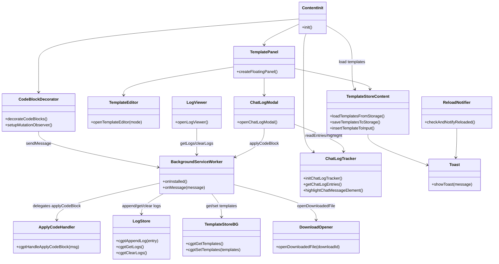

# gpt-code-saver-extension

Chrome 拡張「gpt-code-saver-extension」のソースです。ChatGPT が生成したコードブロックの 1 行目に `// file: path/to/file.ext` または `# file: path/to/file.ext` を記述すると、ボタン 1 つでローカル プロジェクトに直接保存できます。さらに、ChatGPT 入力欄に貼り付けるテンプレートの管理・貼り付け・編集 UI や、チャット履歴の収集・参照 UI も提供します。v0.0.3 ではコードブロック装飾ロジック・ビュー切替・保存ボタン処理を責務ごとにファイル分割し、背景とコンテンツの双方から共有できるファイルパスバリデータを導入しました。

## 主な機能
- ✅ **コードブロックの自動保存** – `Apply to project` ボタンで `chrome.downloads` API を利用し、指定したファイルパスに上書き保存します。
- ✅ **保存(指定)で OS の保存ダイアログを使用** – `保存(指定)` ボタンから `chrome.downloads` の `saveAs` ダイアログを開き、任意の保存先を選択できます。
- ✅ **保存ログの記録・閲覧** – 成功／失敗を `chrome.storage.local` に保存し、UI モーダルから参照・削除できます。
- ✅ **テンプレート管理パネル** – ChatGPT の画面右下にフローティング パネルを追加し、テンプレートの追加・編集・削除・貼り付けを行えます。
- ✅ **テンプレート同期** – テンプレートは `chrome.storage.sync` に保存され、ブラウザ間で同期されます。
- ✅ **保存ログ／再ダウンロード** – `chrome.storage.local` に保存したログをモーダルで参照し、失敗時の再実行や `chrome.downloads.open` によるファイルオープンが行えます。
- ✅ **チャットログタイムライン** – `chatLogTracker` がユーザーとアシスタントの発話を追跡し、モーダルからコードブロック単位でジャンプや即時ダウンロードができます。
- ✅ **拡張機能リロード通知** – バックグラウンドの更新時にトースト通知で知らせます。

## セットアップ & インストール
1. このリポジトリをクローンまたは ZIP で取得し、任意のディレクトリに展開します。
2. Chrome で `chrome://extensions/` を開き、右上の **デベロッパーモード** を有効にします。
3. **パッケージ化されていない拡張機能を読み込む** をクリックし、展開したディレクトリを選択します。
4. ChatGPT (`https://chat.openai.com/` または `https://chatgpt.com/`) を開き、右下に表示されるヘルパーパネルとコードブロックの `Apply to project` ボタンを確認します。

> ビルド ステップは不要です。`background/` や `content/` 以下のファイルがそのまま読み込まれます。

## 使い方
### コードブロックを保存する
1. ChatGPT にコードの生成を依頼するとき、**必ず 1 行目に保存先パスを記述**するようプロンプトします。
2. 回答のコードブロック右上に追加される **Apply to project** ボタンを押すと、バックグラウンド サービスワーカーが `chrome.downloads.download` を実行してローカル ファイルに上書き保存します。`保存(指定)` ボタンを押すと OS の保存ダイアログが開き、任意のパスに保存できます。
3. 成功／失敗は画面下部のトーストとログに記録されます。ログはパネルの「ログ」ボタンから参照できます。
4. ヘルパーパネルの「保存オプション」で「保存時に1行目の file: 行を削除」を有効にすると、`保存`/`保存(指定)` でメタデータ行を除去して保存できます。

### テンプレート パネルを使う
1. 「テンプレ」ドロップダウンからテンプレートを選択し、「選択テンプレ貼り付け」で ChatGPT 入力欄に貼り付けます。
2. 「編集」「追加」ボタンでテンプレート モーダルを開き、タイトルと内容を編集します。保存すると `chrome.storage.sync` に永続化されます。
3. 拡張が更新された直後は `reloadNotifier` がトースト通知でサービスワーカーの再読み込み完了を知らせます。

### チャットログをたどる
1. 右下パネルの「チャットログ」ボタンからモーダルを開き、`chatLogTracker` が収集したユーザー発話一覧を表示します。
2. 各カード内の「ジャンプ」で元のメッセージへスクロールし、ハイライト表示させます。
3. 返信に含まれるコードブロックはファイルパスごとに抽出され、「ダウンロード」で即座に `applyCodeBlock` のフローを呼び出せます。

## アーキテクチャ
```
manifest.json (MV3)
├─ background/
│  ├─ index.js          … ルート初期化。onInstalled 登録とメッセージハンドラ設定。
│  ├─ applyCode.js      … ダウンロード API を呼び出して保存＆ログを記録。
│  ├─ logStore.js       … chrome.storage.local でログの追加・取得・削除。
│  ├─ templateStore.js  … chrome.storage.sync でテンプレートを取得・保存。
│  └─ messageHandlers.js … type ごとの runtime メッセージハンドラを集約。
│  └─ reloadState.js    … 拡張の再読込状態を管理し、初回起動で更新。
├─ shared/
│  └─ filePathValidation.js … 背景・コンテンツ共通のファイルパス検証ロジック。
└─ content/
   ├─ init.js           … 初期化エントリ。テンプレ読込→UI生成→コード監視。
   ├─ state.js          … テンプレ配列/選択 ID を集約管理するアクセサ群。
   ├─ saveOptions.js    … 保存時のメタデータ除去フラグを保持。
   ├─ chatInput.js      … ChatGPT 入力欄の検出とテキスト挿入ユーティリティ。
   ├─ templateStore.js  … テンプレの同期、貼り付けコマンドの調停役。
   ├─ templateEditor.js … モーダル UI と CRUD 操作。
   ├─ panel.js          … 画面右下のフローティング パネル。
   ├─ codeBlockMetadata.js … コードブロック先頭の `file:` メタデータを解析。
   ├─ codeBlockViewMode.js … ラップ要素生成、行数制御、ビュー切替処理。
   ├─ codeBlockButtons.js … 保存/コピー/表示切替ボタン生成とハンドラ群。
   ├─ codeBlocks.js     … `pre code` 装飾のエントリ。各責務モジュールを連携。
   ├─ logModal.js       … 保存ログのモーダル表示＋ファイルオープン。
   ├─ chatLogTracker.js … ユーザー／アシスタント発話とコードブロックを追跡。
   ├─ chatLogModal.js   … チャット履歴と対応コードブロックを一覧化。
   ├─ toast.js          … 軽量トースト通知。
   └─ reloadNotifier.js … 拡張リロード通知の表示。
```

### クラス図 (モジュール間の責務)


## メッセージ フロー
| 送信元 | 宛先 | type | 役割 |
| ------ | ---- | ---- | ---- |
| content/codeBlocks | background/index | `applyCodeBlock` | コード保存を要求し、結果をログ化 |
| content/chatLogModal | background/index | `applyCodeBlock` | 履歴モーダルから即時ダウンロードを要求 |
| content/templateStore | background/index | `getTemplates` / `setTemplates` | テンプレートの同期 |
| content/logModal | background/index | `getLogs` / `clearLogs` | 保存ログをモーダルに表示 |
| content/logModal | background/index | `openDownloadedFile` | ダウンロード済みファイルを OS で開く |

## 開発メモ
- 依存する npm パッケージやビルドはありません。必要に応じて `content/` や `background/` の JS ファイルを直接編集してください。
- デバッグ時は DevTools > Sources > Service Workers で `background/index.js` を確認し、`chrome.runtime.sendMessage` のレスポンスを追跡します。
- 既定テンプレート文言は `content/defaultTemplate.js` の `DEFAULT_TEMPLATE_CONTENT` / `cgptGetDefaultTemplateContent` で定義・取得でき、`cgptCreateDefaultTemplate` でテンプレート オブジェクトを生成します。`cgptSetTemplates`/`cgptSetSelectedTemplateId` アクセサを経由することで状態破壊的な変更を避け、単一責務を保ちながら拡張できます。
