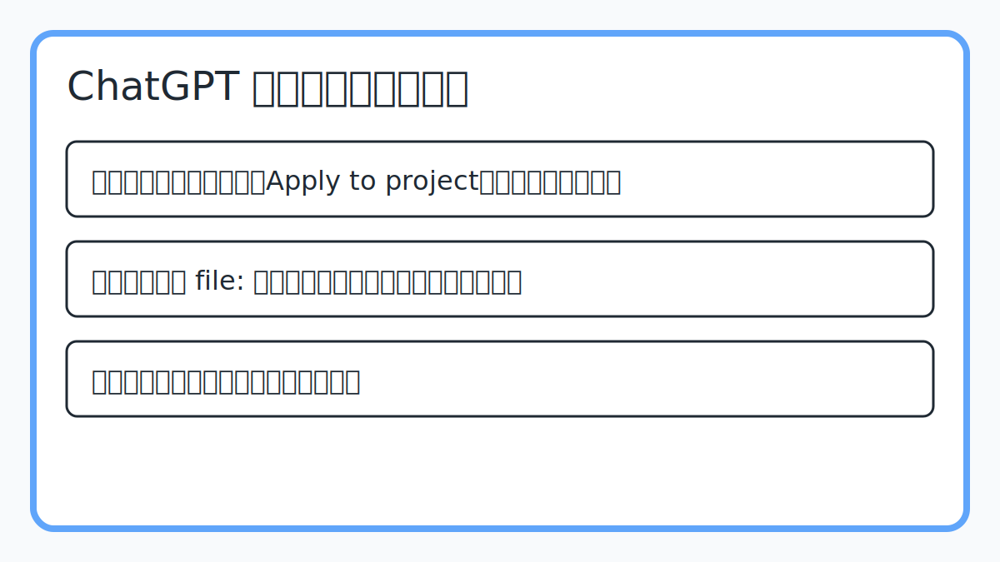
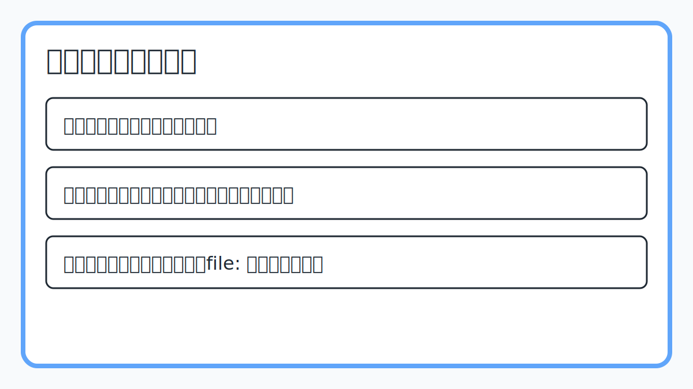

# gpt-code-saver-extension

ChatGPT が生成したコードを、迷わず自分のローカル プロジェクトへ取り込める Chrome 拡張機能です。コードの 1 行目に `// file: path/to/file.ext` や `# file: path/to/file.ext` を書いておけば、`Apply to project` ボタンでそのパスへ上書き保存できます。テンプレート管理やチャットログ閲覧もできるため、普段の開発フローにすぐ馴染みます。

> 拡張の内部構成を知りたい場合は [DEVELOPERS.md](DEVELOPERS.md) をご覧ください。

## インストール手順
1. このリポジトリを ZIP で取得するか `git clone` します。
2. Chrome で `chrome://extensions/` を開き、右上の **デベロッパーモード** をオンにします。
3. **パッケージ化されていない拡張機能を読み込む** をクリックし、展開したディレクトリを選択します。
4. ChatGPT ( `https://chat.openai.com/` または `https://chatgpt.com/` ) を開き、右下のヘルパーパネルとコードブロックの `Apply to project` ボタンが表示されることを確認します。

> ビルド工程は不要です。`background/` と `content/` 直下のファイルがそのまま読み込まれます。

## 使い方

### 1. ChatGPT でコードを受け取る
1. ChatGPT へのプロンプトで、**生成するコードの 1 行目に `file:` で始まる保存先パスを含めるよう伝えます**。
2. 回答のコードブロック右上に表示される **Apply to project** ボタンをクリックすると、そのパスへすぐ保存できます。
3. `保存(指定)` を押すと OS 標準の保存ダイアログが開き、任意の場所へ保存することも可能です。
4. 処理結果は画面下部のトースト通知と保存ログに残り、あとからモーダルで確認できます。

### 2. ヘルパーパネルを活用する
1. 画面右下に表示されるヘルパーパネルでは、テンプレート／チャットログ／保存オプションをまとめて管理できます。
2. 「テンプレ」タブでテンプレートを選び「選択テンプレ貼り付」ボタンを押すと、ChatGPT の入力欄へ即座に挿入されます。
3. 「チャットログ」タブでは、これまでの発話とコードブロックを一覧表示し、元メッセージへのジャンプや再保存が行えます。
4. 「保存オプション」で「保存時に1行目の file: 行を削除」をオンにすると、コードだけを保存できます。

## 権限とプライバシー
- 使用する権限は `chrome.storage`, `chrome.downloads`, `activeTab`, `scripting` など、拡張の機能に必要な最小限です。
- 取得したテンプレート・ログ・チャットメタデータはすべてローカルブラウザ内に保存され、外部サーバーへ送信されません。

## サポート
- 既知の制限や最新の開発情報は [DEVELOPERS.md](DEVELOPERS.md) を確認してください。
- バグ報告や改善案は Issue で受け付けています。再現手順と Chrome バージョンを記載していただけると助かります。
