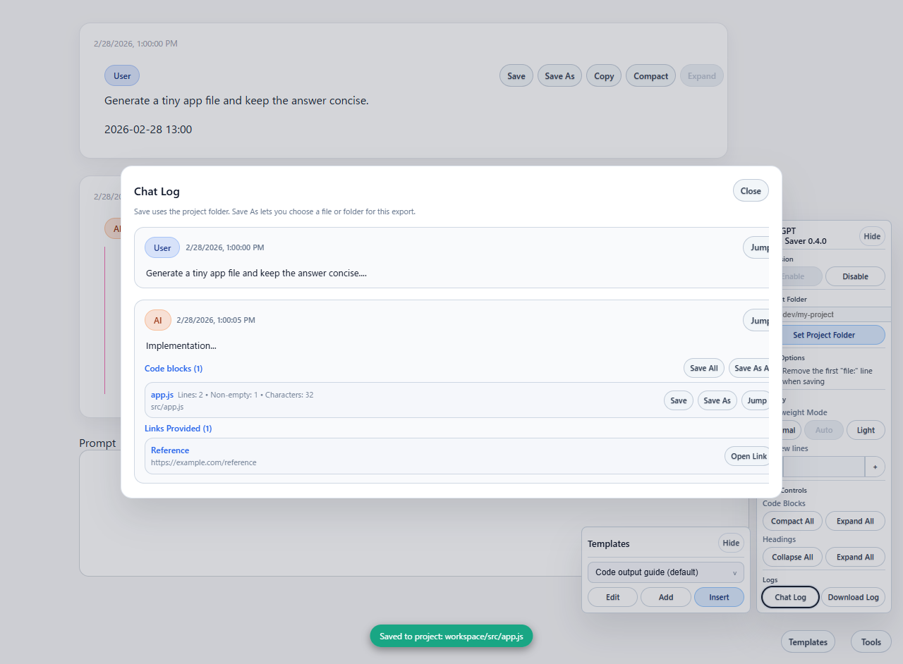
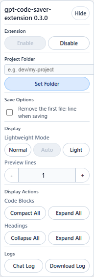
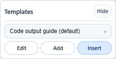
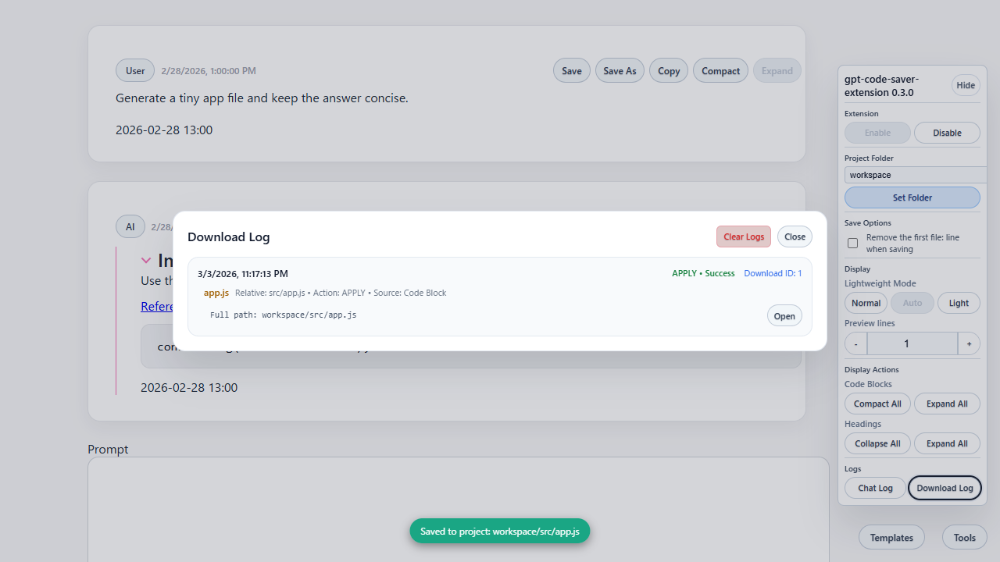

# ChatGPT Code Saver

ChatGPT が生成したコードを、ローカルのプロジェクトへそのまま保存するための Chrome 拡張です。コードブロックの 1 行目に `// file: path/to/file.ext` または `# file: path/to/file.ext` があれば、`Save` でその相対パスへ保存できます。テンプレート挿入、チャットログ参照、保存ログ確認も同じ UI にまとめています。

> 内部実装や開発メモは [DEVELOPERS.md](DEVELOPERS.md) にまとめています。利用方法だけならこの README で足ります。

## できること
- `file:` メタデータ付きコードブロックを `Save` で project folder 配下へ保存
- `Save As` / `Save All` / `Save As All` による単体保存と一括保存
- テンプレートの保存、編集、選択、ChatGPT 入力欄への挿入
- チャットログの一覧表示、元メッセージへのジャンプ、再保存
- 保存ログの一覧表示と保存先ファイルの再オープン

## 画面イメージ

### コード保存とチャットログ

実際の README 動作確認で取得したキャプチャです。コード保存トースト、チャットログモーダル、右下の拡張パネルが同時に表示されています。



### メインパネル

project folder、保存時オプション、表示設定、ログ操作をひとまとめで切り替えられます。



### テンプレートパネル

保存済みテンプレートを選んで、そのまま ChatGPT 入力欄へ挿入できます。



### 保存ログ

保存結果は Download Log に残り、保存先や action、source を後から確認できます。



## インストール
1. このリポジトリを ZIP で取得するか `git clone` します。
2. Chrome で `chrome://extensions/` を開き、右上の `デベロッパーモード` をオンにします。
3. `パッケージ化されていない拡張機能を読み込む` を選び、このリポジトリの `extension/` ディレクトリを指定します。
4. `https://chatgpt.com/` または `https://chat.openai.com/` を開き、右下にパネルが表示されることを確認します。

> ビルドは不要です。`extension/` 配下をそのまま読み込みます。

## 使い方

### 1. コードブロックを保存する
1. ChatGPT への指示で、コードの 1 行目に `file:` 付きの保存先パスを含めるよう伝えます。
2. `file:` があるコードブロックでは `Save` を押すと、設定済み project folder 配下の対象パスへ保存されます。

### ChatGPT share URL から資材を取得する
共有 URL から HTML / スクリーンショット / CSS / コードブロック周辺の style 情報を保存できます。

```bash
npm run fetch:share-assets -- https://chatgpt.com/share/your-share-id
```

出力先:
- `tests/artifacts/chatgpt-share-assets/<share-id>/page.html`
- `tests/artifacts/chatgpt-share-assets/<share-id>/page.png`
- `tests/artifacts/chatgpt-share-assets/<share-id>/first-code-block.html`
- `tests/artifacts/chatgpt-share-assets/<share-id>/metadata.json`
- `tests/artifacts/chatgpt-share-assets/<share-id>/styles/*.css`

あとで「この共有 URL から資材を取り込んで反映して」と指示されたら、この取得結果を元に実装側へ反映できます。
3. `Save As` は `file:` の有無に関係なく使えます。保存ダイアログから任意の場所を選べます。
4. 複数ブロックをまとめて扱うときは `Save All` / `Save As All` を使います。

### 2. project folder と保存オプションを設定する
1. 右下のパネルで `Set Project Folder` を押して project folder を設定します。
2. `Remove the first "file:" line when saving` をオンにすると、保存時に先頭の `file:` 行を除去します。
3. `Lightweight Mode`、`Preview lines`、`Compact All` / `Expand All` でコード表示量を調整できます。

### 3. テンプレートを使う
1. `Templates` を開いてテンプレートを選択します。
2. `Insert` を押すと、選択中テンプレートが ChatGPT の入力欄へ挿入されます。
3. `Add` と `Edit` でテンプレートを管理できます。

### 4. チャットログと保存ログを使う
1. `Chat Log` では発話、見出し、コードブロック、リンクを一覧できます。
2. chat text の `Save` は `chat-logs/<conversationKey>/...` へ保存します。`Save As` は保存先を選んで 1 件ずつ保存します。
3. `Download Log` では保存結果、保存先、action、source を確認できます。

## 権限とプライバシー
- 使用する権限は `chrome.storage`, `chrome.downloads`, `activeTab`, `scripting` など、機能に必要な最小限です。
- テンプレート、保存ログ、チャットメタデータはローカルブラウザ内に保存され、外部サーバーへ送信されません。

## 関連ドキュメント
- 開発者向けメモ: [DEVELOPERS.md](DEVELOPERS.md)
- 補助ドキュメント: [docs/misc](docs/misc)
